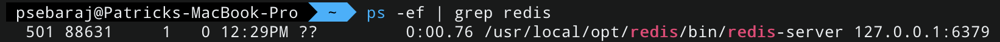

# GoGetItDone
Backend of a to-do app. Written in Go and utilizes Redis and PostgreSQL.

## Justifications for Technology Stack
### Redis
- Redis is used to cache tasks
	- Users will likely view a task's details frequently in a short span of time.

### PostgreSQL
- PostgreSQL is used for long-term storage of tasks
	- There will be many different types of tasks
	- Object inheritance for these types of tasks beyond the standard task
	- e.g. expiring tasks, priority tasks, overdue tasks

## Testing

### Redis
- Install Redis, if not already installed
- To install:
	- `brew install redis`
	- `brew services start redis`
	- `redis-server /usr/local/etc/redis.conf`
- Check if Redis is running and its port:
	- `ps -ef | grep redis`
	- 

### Start Backend
- To run the backend of the application, first clone the repository:
	- `git clone https://github.com/psebaraj/gogetitdone.git`

- Navigate to the GoGetItDone directory

- Build and run the application:
	- `go run main.go`

### Postman
The Postman collection for testing the REST API functions can be found [here](https://www.getpostman.com/collections/40ab42d058be92ae4ef7):

To test:
- Open Postman &rarr; Import &rarr; Link &rarr; Paste link from above &rarr; Import
- Start backend, as described above

