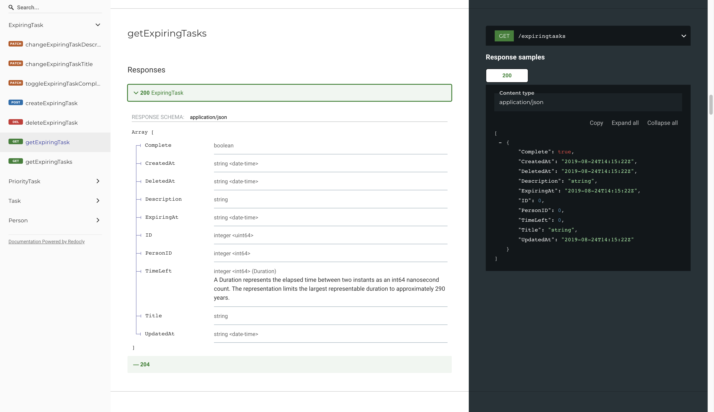

# GoGetItDone

Backend of a to-do app. Written in Go and utilizes Redis and PostgreSQL.

## To-Do:
- [x] Use Prepare (Postgres) to cache PSQL statements for speed (v1.1.0)
	- UpdateExpiringTask and /database/taskFunctions.go
	- [GORM Doc 1](https://gorm.io/docs/performance.html) and [GORM Doc 2](https://gorm.io/docs/v2_release_note.html#Prepared-Statement-Mode)
- [ ] Refactor tasks with interfaces (v1.1.0)
	- Common methods for all tasks: Change Title, Change Description, Toggle Complete, Change Project
- [ ] Refactor codebase to adhere to standard [Go project layout](https://github.com/golang-standards/project-layout)

### New Features for v1.1.0:
- [x] Projects: collection(s) of (all types of) tasks owned by a person
	- Different "projects" for tasks from courses, work, etc.
- [ ] Groups: collection(s) of people where users can share tasks
	- One "group" for family members, another "group" for work colleagues, etc.

## Features
- Getting an expiring task will return the expiration time in the local time zone of the origin of the request
	- Give expiry time for expiring tasks in GMT for consistency
- Getting a user returns their details and all of their tasks
	- (Regular) tasks, expiring tasks, priority tasks, etc.
- Swagger endpoint documentation

getExpiringTasks                        |getPerson
:--------------------------------------:|:--------------------------------------:
|

## Justifications for Technology Stack
### Redis
- Redis is used to cache tasks
	- Users will likely view a task's details frequently in a short span of time.
	- Note that only the tasks are cached, not the user data

### PostgreSQL
- PostgreSQL is used for long-term storage of tasks
	- There will be many different types of tasks
	- Object inheritance for these types of tasks beyond the standard task
	- e.g. expiring tasks, priority tasks, overdue tasks
- User will have a one-to-many relationship with tasks

## Testing
### Redis
- Install Redis, if not already installed
- To install:
	- `brew install redis`
	- `brew services start redis`
	- `redis-server /usr/local/etc/redis.conf`
- Check if Redis is running and its port:
	- `ps -ef | grep redis`
	- 

### PostgreSQL
- Install Postgres, if not already installed
	- `brew install postgresql`
	- `initdb /usr/local/var/postgres/`
- Start Postgres
	- `sudo psql -U my_macosx_username postgres`
	- `brew services start postgresql`
	- `ALTER USER my_macosx_username PASSWORD 'new_password';`
	- `CREATE DATABASE todo_list;`

### Start Backend
- To run the backend of the application, first clone the repository:
	- `git clone https://github.com/psebaraj/gogetitdone.git`
- Navigate to the GoGetItDone directory
- Create .env file and entire appropriate credentials for:
	- `DB_DIALECT, DB_HOST, DB_PORT, DB_USER, DB_NAME, DB_PASSWORD`
	- `REDIS_HOST, REDIS_PORT, REDIS_PASSWORD`
- Build and run the application:
	- `go run main.go`

### Postman
The Postman collection for testing the REST API functions can be found [here](https://www.getpostman.com/collections/40ab42d058be92ae4ef7)
